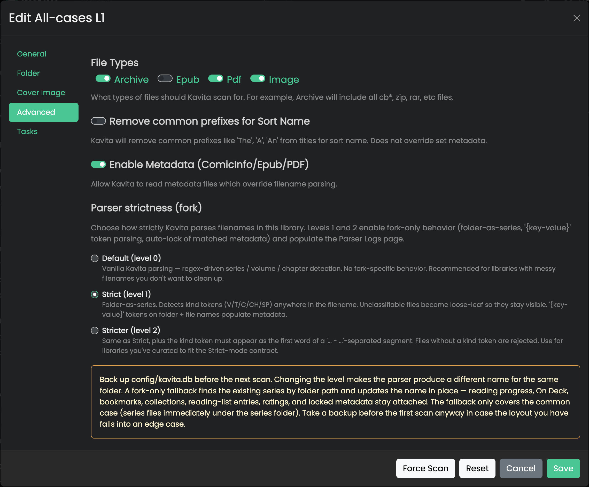
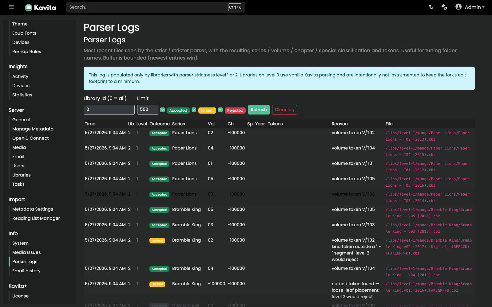
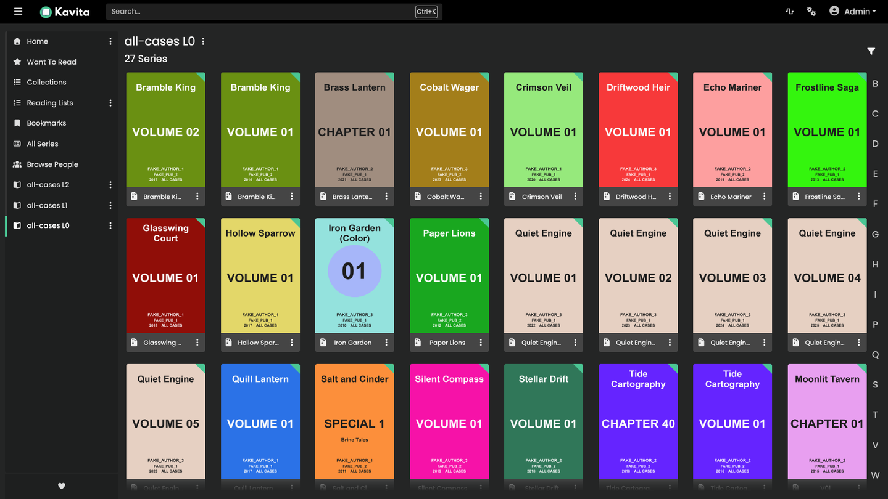
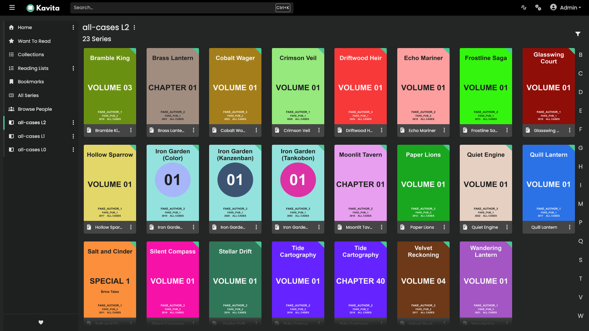

# Kavita Strict-Parser Fork

This fork adds an opt-in **strict parser** to
[Kavita](https://github.com/Kareadita/Kavita).

The point is predictability. In strict mode, the series folder is the source of
truth. You should not have to do the usual loop of scan, inspect what the parser
guessed, rename files, rescan, and hope it grouped things correctly this time.

Level 0 is still upstream Kavita. Strict parsing only runs on libraries where
you explicitly enable it.

Upstream declined this feature for now. That is a parser philosophy difference,
not a hard fork of the whole project.

## Why strict layout exists

Media servers work best when the scanner has a predictable contract. Once Plex,
Jellyfin, or Kavita is set up, you normally consume media from the UI. You do
not keep browsing the filesystem just to watch or read something.

That means matching needs to be boring and reliable.

Kavita's library homepage is flat: series are top-level items. Related series
can be linked, but the UI does not nest series inside series. Strict mode
matches that model:

```text
<library root>/
├── Series A/
├── Series B/
└── Series C/
```

One immediate child folder of the library root is one series.

This is the same kind of constraint Plex and Jellyfin use. They do not try to
make arbitrary nesting part of the scanner contract. For example, this kind of
layout is not accepted as a meaningful media-library hierarchy:

```text
George Lucas/
└── Star Wars/
    └── Trilogy/
        ├── Episode 4.mkv
        ├── Episode 5.mkv
        └── Episode 6.mkv
```

That is a media-server example, not a Kavita example. The point is the same:
unbounded nesting adds scanner complexity without a matching UI concept. If the
app has to flatten everything back into a series grid anyway, accepting deeply
nested structures mostly creates edge cases.

Those edge cases matter. If parser behavior changes, files can be rebucketed,
series can split or merge, and reading history can end up attached to the wrong
row. Strict mode reduces that risk by aligning the filesystem contract with the
UI: one folder, one series, predictable output, no regex shenanigans.

More detail lives in:

- [`fork-docs/parser-strictness.md`](fork-docs/parser-strictness.md) for the
  strict parser contract.
- [`fork-docs/design-philosophy.md`](fork-docs/design-philosophy.md) for the
  rebase and data-preservation decisions.
- [`fork-docs/migrating-back-to-upstream.md`](fork-docs/migrating-back-to-upstream.md)
  for switching back to upstream Kavita.

## Branches, Tags, and Images

Each release branch starts from an upstream Kavita tag and carries this fork's
patches on top.

```text
upstream tag  -> fork branch              -> fork release tag
v0.9.0.2      -> 0.9.0.2-patched-0.1.0    -> v0.9.0.2-patched-0.1.0
v0.9.0.2      -> 0.9.0.2-patched-0.1.1    -> v0.9.0.2-patched-0.1.1
v0.9.1        -> 0.9.1-patched-0.1.0      -> v0.9.1-patched-0.1.0
```

- Branches omit the leading `v`.
- Release tags keep the leading `v`.
- Docker publish only runs for tags matching `v*-patched-*`.

Images are published to GitHub Container Registry:

```text
ghcr.io/<owner>/kavita-strict-fork:v<upstream-version>-patched-<fork-version>
ghcr.io/<owner>/kavita-strict-fork:latest
```

`<owner>` is the GitHub user or org that owns the fork.

## Docker

This image follows the official Kavita image layout, not the LinuxServer.io
layout.

```yaml
services:
  kavita:
    image: ghcr.io/<owner>/kavita-strict-fork:latest
    container_name: kavita
    volumes:
      - ./config:/kavita/config
      - ./manga:/manga
    ports:
      - 5000:5000
    restart: unless-stopped
```

If you use `linuxserver/kavita`, do not reuse that compose file unchanged. LSIO
uses different paths and runtime conventions.

Parser strictness defaults to level 0 for every library, so the fork behaves
like upstream until you opt in.

## Enabling Strict Mode

1. Open Kavita as an admin.
2. Go to **Settings -> Server -> Libraries**.
3. Edit a library and open the **Advanced** tab.
4. Set **Parser strictness (fork)**:
   - **Default (level 0):** upstream Kavita behavior.
   - **Strict (level 1):** folder-as-series with lenient token detection.
   - **Stricter (level 2):** folder-as-series and stricter filename tokens.
5. Save and run a **Force Scan**.



The first scan after changing levels should be a Force Scan. A normal scan can
skip folders whose mtime has not changed, which means the parser may not run on
existing files.

## Back Up Before Changing Levels

The fork tries to preserve `SeriesId` when parser output changes. If a by-name
match fails, the scanner falls back to `Series.FolderPath` and updates the
existing row in place. Reading progress, bookmarks, collections, reading lists,
ratings, On Deck, and locked metadata stay attached to the same series row.

Still, changing parser levels is a series re-identification event. Back up
`config/kavita.db` before the first Force Scan.

```bash
sqlite3 config/kavita.db ".backup config/kavita-pre-strict-scan.db"
```

The folder-path fallback only works when upstream and strict mode agree on the
series folder. If upstream previously identified a deeper folder as the series
folder, strict mode cannot always bridge that automatically. The rollback guide
explains the safe path back to upstream.

## What Strict Mode Expects

Short version:

- Each immediate child folder of a library root is one series.
- Folder names may end with `{key-value}` tokens and `(YYYY)`.
- The remaining folder name is the series name.
- Files carry one kind token: `V<n>`, `T<n>`, `C<n>`, `CH<n>`, or `SP<n>`.
- `Specials/` marks files as specials.

Example:

```text
Series Alpha (2020) {aniListId-50007}/
├── Series Alpha - V01.cbz
├── Series Alpha - V02.cbz
└── Specials/
    └── Series Alpha - SP01.cbz
```

Full details are in
[`fork-docs/parser-strictness.md`](fork-docs/parser-strictness.md).

## Parser Logs

When strict mode parses a file, the **Parser Logs** page shows what happened:

- Accepted, Lenient, or Rejected.
- The series, volume, chapter, or special that was detected.
- Folder and filename tokens.
- The reason for the outcome.

Find it at **Settings -> Info -> Parser Logs**.



The log is in memory and keeps the newest entries only. It resets when the
server restarts.

## Screenshots and Test Fixture

The screenshots below use the synthetic strict-parser fixture in
`Kavita.Services.Tests/Test Data/StrictParser/`. The fixture uses made-up
series names and generated files so it can be shared safely.

**Default (level 0):** upstream parser behavior. Some fixture series split or
merge because filenames drive identity.



**Strict (level 1):** folder identity, lenient filename handling.


**Stricter (level 2):** folder identity, stricter filename handling.



One known Kavita behavior remains: if one folder mixes archive files and loose
image folders, Kavita may create one series row per `MangaFormat`. That split
happens downstream from parsing. See the known limitations section in
[`fork-docs/parser-strictness.md`](fork-docs/parser-strictness.md).

## Preserving Original Filenames

If strict mode rejects a file and you need to rename it, you can keep the old
name in an `extra*` token:

```text
Series A/Series A - T07 {extraOriginalFilename-Series A Spinoff V01.cbz}.cbz
```

`extraOriginalFilename` and other `extra*` tokens are accepted today and
ignored by the parser. They are a safe place to keep provenance in the filename
without breaking scans.

## Not in This Fork

- Multi-value folder metadata like genres, tags, writers, and summaries.
  Use ComicInfo.xml for that.
- Level 0 parser fixes. Level 0 stays upstream behavior to keep rebases small.
- Compatibility shims for old schemas, API params, or config keys.

## Switching Back to Upstream

Swap the image and keep the config volume. Upstream Kavita tolerates the extra
`ParserStrictnessLevel` column. Metadata locks set by the fork remain normal
Kavita metadata locks.

If a library used strict mode, switch it back to level 0 and Force Scan while
still running the fork before swapping images. That gives the folder-path
fallback a chance to normalize series names back toward upstream behavior while
keeping `SeriesId` stable.

Details are in
[`fork-docs/migrating-back-to-upstream.md`](fork-docs/migrating-back-to-upstream.md).

## Reporting Issues

This fork has no support commitment. File issues only for strict-mode behavior.
For upstream Kavita behavior, use the upstream project.
